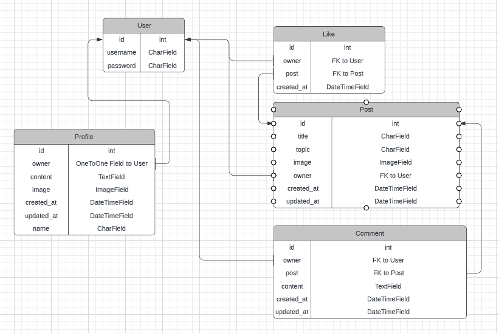
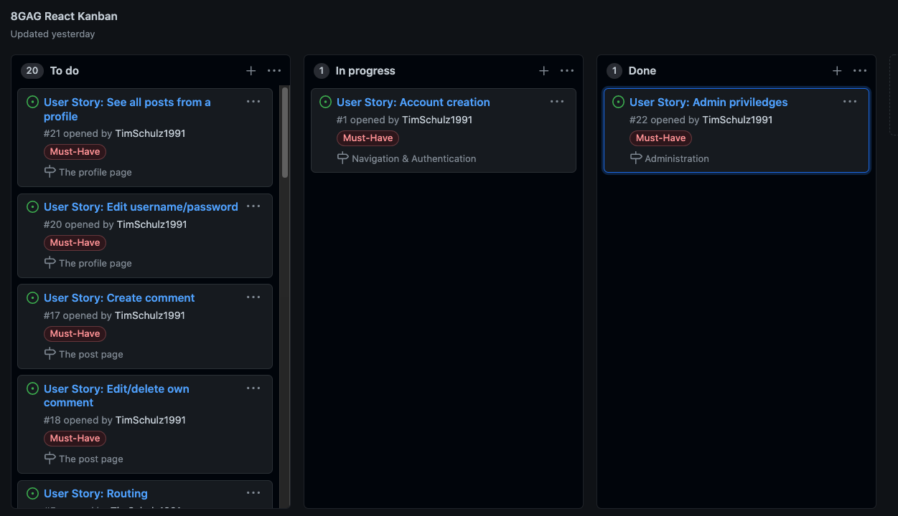

# 8GAG - Backend in DRF - [Live link](https://drf-api-8gag.herokuapp.com/)

If you want to laugh and enjoy some good memes, you have come to the right place - to 8GAG!

This repository contains information about the Django REST Framework API, built specifically for the 8GAG frontend React application ([Repo here](https://github.com/TimSchulz1991/project5-8GAG-React/) and [deployed website here](https://react-8gag.herokuapp.com/)).

All the information about the project, its goals, the end user stories, and much more can be found in the [README](https://github.com/TimSchulz1991/project5-8gag-react/blob/main/README.md) of the frontend 8GAG application.

# Data Model

The backend API for the 8GAG project was built with the Django REST Framework.

## ERD

Below you can see the ER diagram for this project, to get an instant overview of the different models used. 

### User model

- id of the User model is linked via a OneToOne relation to the Profile model owner field
- id of the User model is linked via a ForeignKey relation to the Post model owner field
- id of the User model is linked via a ForeignKey relation to the Comment model owner field
- id of the User model is linked via a ForeignKey relation to the Like model owner field

### Post model

- id of the Post model is linked via a ForeignKey relation to the Comment model post field
- id of the Post model is linked via a ForeignKey relation to the Like model post field

## Database

- SQLite was used in delevopment to store data
- PostgreSQL is used in production to store data

# User Stories

For the backend part of this entire 8GAG project, there is only one user story: 

- As an admin, I want to be able to manage (create, edit, delete) all the users, posts, comments and likes, so that I can for example delete malicious content from the page

# Agile

For this project the GitHub Kanban agile project management tool was used to create EPICs, add User Stories to these EPICs --> [8GAG Kanban](https://github.com/TimSchulz1991/project5-8GAG-React/projects/1). 

Throughout the development process, the stories were constantly updated according to the progress and pushed into the right cloumn (in progress / done).

# Technologies

## Languages used
- [Python](https://www.python.org/)

## Workspace

### Gitpod
[GitPod](https://gitpod.io/) was used as a virtual IDE workspace to build this site.

## Version Control

### Git
[Git](https://git-scm.com/) was used for version control by utilizing the Gitpod terminal to add and commit to Git and push to GitHub.

### GitHub
[GitHub](https://github.com/) is used to store the code for this project after being pushed from Git.

## ERD

### Lucid
[Lucid](https://lucid.app/) was used to create the ERD overview.

## Development

### Django Rest Framework
[Django REST Framework](https://www.django-rest-framework.org/) was used to build the backend API.

### Django AllAuth
[Django AllAuth](https://django-allauth.readthedocs.io/en/latest/index.html) was user for user authentication.

## Hosting/Database

### Heroku
[Heroku](https://id.heroku.com/login) is used to host the application.

### Gunicorn
[Gunicorn](https://gunicorn.org/) is used for deploying the project to Heroku.

### Cloudinary
[Cloudinary](https://cloudinary.com/) is used to host the static and media files and serve them to Heroku.

### Pillow 
[Pillow](https://pillow.readthedocs.io/en/stable/) was used for image processing and validation.

### Psycopg2
[psycopg2](https://www.psycopg.org/docs/) was used for PostgreSQL Python adaption.

### PostgreSQL
[PostgreSQL](https://www.postgresql.org/) is used as the production database.

# Testing

## Pep8

- [PEP8](http://pep8online.com/) shows no errors, except for some default code being too long (over the 80 char limit) in the settings.py file.

## Manual testing of user stories

Relating back to the user story of this README: 
- As an admin, I want to be able to manage (create, edit, delete) all the users, posts, comments and likes, so that I can for example delete malicious content from the page
    - All works as intended. The testing is described in more detail in the table below.

| Test       | Action            | Expected Result               | Pass |
| ---------- | ---------------- | --------------------------- | ---- |
| Users     | Create, edit, delete   | A user can be created, edited or deleted.   | ✓    |
| Users     | Update permissions  | The user permissions can be updated.      | ✓    |
| Profiles   | Create, edit, delete | A profile can be created, edited or deleted.  | ✓    |
| Posts  | Create, edit, delete       | A post can be created, edited or deleted.        | ✓    |
| Comments   | Create, edit, delete | A comment can be created, edited or deleted.   | ✓    |
| Likes   | Create, edit, delete | A like can be created, edited or deleted.   | ✓    |

# Deployment

## Development

1.  Clone [this repository](https://github.com/TimSchulz1991/project5-8GAG-DRF-API).
2.  In your IDE, connect to your repo, then enter this command in the terminal:
        
        pip install -r requirements.txt

- Make sure your INSTALLED_APPS in settings.py look like this:

        INSTALLED_APPS = [
        'django.contrib.admin',
        'django.contrib.auth',
        'django.contrib.contenttypes',
        'django.contrib.sessions',
        'django.contrib.messages',
        'cloudinary_storage',
        'django.contrib.staticfiles',
        'cloudinary',
        'rest_framework',
        'django_filters',
        'rest_framework.authtoken',
        'dj_rest_auth',
        'django.contrib.sites',
        'allauth',
        'allauth.account',
        'allauth.socialaccount',
        'dj_rest_auth.registration',
        'corsheaders',
        'profiles',
        'posts',
        'comments',
        'likes',
        ]

3. In you terminal, enter these commands in the terminal:

        python manage.py makemigrations
        python manage.py migrate

4.  Git add, commit and push all changes to your repo.
5.  Create or log in to an account on Heroku.
6.  Create a new app on Heroku.
7.  Open your app on Heroku, go to Resources, Add-ons and search for PostgreSQL, then add it.
8.  In the Deploy tab on Heroku, go to Deployment method and add your GitHub repository.
9.  In the Deploy tab on Heroku, go to Manual deploy and select deploy branch for early deployment.
10. Create or log in to an account on Cloudinary.
11. Copy your API Environment Variable.
12. Go back to Heroku, Settings and click on Reveal Config Vars.
13. Add these variables to your config vars. PostgreSQL DATABASE_URL should already be there.
    - ALLOWED_HOST | your_deployed_api_url
    - CLIENT_ORIGIN | your_deployed_frontend_url
    - CLIENT_ORIGIN_DEV | your_local_server_url
    - CLOUDINARY_URL | your_api_variable
    - SECRET_KEY | your_choice ([Secret Key Generator](https://miniwebtool.com/django-secret-key-generator/))
    - DISABLE_COLLECTSTATIC | 1
14. Create an env.py in the root directory, add it to .gitignore and add these lines at the top

        import os

        os.environ["SECRET_KEY"] = "your secret_key here"
        os.environ["CLOUDINARY_URL"] = "cloudinary url here"
        os.environ['DEV'] = '1'

15. In settings.py, update the CORS_ALLOWED_ORIGIN_REGEXES variable to match your local server url.

        if 'CLIENT_ORIGIN_DEV' in os.environ:
            extracted_url = re.match(r'^.+-', os.environ.get('CLIENT_ORIGIN_DEV', ''), re.IGNORECASE).group(0)
            CORS_ALLOWED_ORIGIN_REGEXES = [
                rf"{extracted_url}(eu|us)\d+\w\.gitpod\.io$",
            ]

16. Create a superuser for your site:

        python manage.py createsuperuser

17. To run your app locally, enter this command in your terminal:
        python manage.py runserver
    
The project is now set up to automatically switch between DEBUG: True and False for development server and deployed site.

## **Production**

1.  If changes has been made, make sure to run migrations:

        python manage.py makemigrations
        python manage.py migrate

2.  Git add, commit and push all changes to your repo.
3.  On Heroku, go to Deploy and and choose manual deploy.
4.  If you want to create a superuser for the deployed page with PostgreSQL as a database, then just replace 

        os.environ['DEV'] = '1'
    with 
        os.environ['DATABASE_URL'] = 'your_postgres_database_url'

5. Now you can create a superuser for the deployed project as described in step 16 above via the terminal of your IDE

# Credits

## Code

This API was built using Django REST Framework. This project is inspired by Code Institute's Django REST API walkthrough project [GitHub](https://github.com/Code-Institute-Solutions/drf-api), as it provided most of the features that I needed for my meme-sharing platform 8GAG. 

Furthermore, my colleague Ali supported me in building the TopicSerializerField class for the post model, including the validation functionality in the PostSerializer class - so that the user can properly add a topic to each post.

## Content 

The content and the layout of this README file was inspired by the work of a fellow CI student Johan Fredriksson for his [project 5](https://github.com/JFrdrkssn/llama-be/blob/main/README.md). Furthermore, I followed the structure of previous README files that I have written for past projects. 

## Media

Default profile image and default post image from [Code Institute](https://codeinstitute.net/) course material.

## Acknowledgements

- First of all I want to thank my fellow CI student Johan Fredriksson for all his support, as he has been going through this whole React/DRF-API project just a few weeks before me; thank you for telling me about all the little traps to avoid for my project, based on the experiences you had. A big thank you also for letting me be inspired by your README files. 
- Thank you to my mentor Antonio Rodriguez, at [Code Institute](https://codeinstitute.net/), for continuous helpful feedback and support.
- Big thanks to my colleague Ali for his ongoing help with all kinds of smaller issues and feedback throughout the project.
- Last but not least, a big thanks to the super friendly and helpful tutor support at [Code Institute](https://codeinstitute.net/).